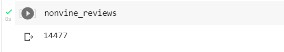
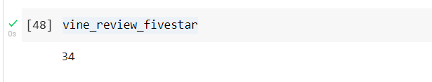
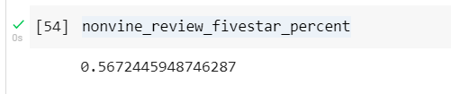

# Amazon Vine Analysis (Module Challenge 16)

[Link to Deliverable 1 Colab code](Amazon_Reviews_ETL.ipynb)

[Link to Deliverable 2 Colab code](Vine_Review_Analysis.ipynb)

## Amazon Vine Analysis

### Overview
The purpose of this project is to analyze Amazon reviews written by members of the paid Amazon Vine program.

Companies pay a small fee to Amazon and provide products to Amazon Vine members, who are then required to publish a review.

This analysis used PySpark to extract reviews related to musical instruments, transform the data, connect to an AWS RDS instance, and load the transformed data into pgAdmin. 

Finally, the analysis used PySpark to determine if there is any bias toward favorable reviews from Vine members in your dataset. 

https://s3.amazonaws.com/amazon-reviews-pds/tsv/index.txt

## Results

The analysis returned the following results:

* How many Vine reviews and non-Vine reviews were there?

  
  
  

* How many Vine reviews were 5 stars? How many non-Vine reviews were 5 stars?

  

  

* What percentage of Vine reviews were 5 stars? What percentage of non-Vine reviews were 5 stars?

  

  

## Summary

This analysis suggests that there is no substantive positivity bias for reviews of musical instruments in the Vine program.

The percent of five-star reviews in the Vine program was 56.67%, compared to 56.72% for non-Vine reviews.

The analysis could be further expanded to include a comparison of Vine versus non-Vine results for all star ratings.

This project was prepared using the following:
* Google Colaboratory
* AWS RDS
* Spark 3.0.3/PySpark
* Postgres 42.2.16
* pgAdmin 4
* Java 11
